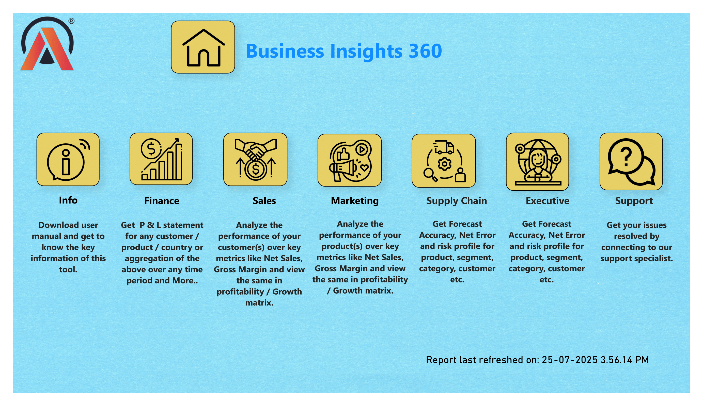
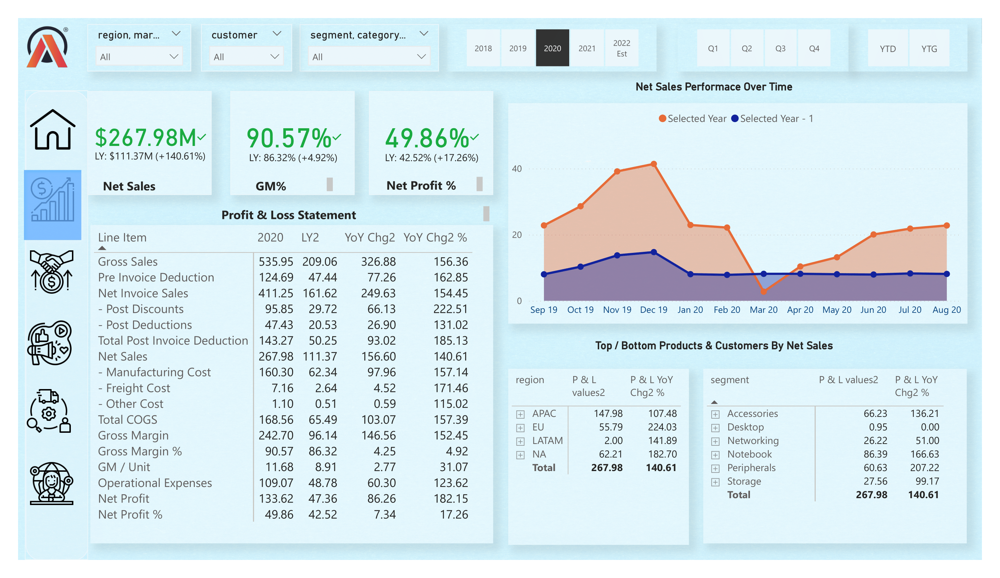
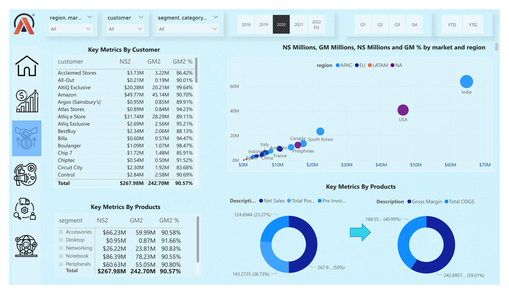
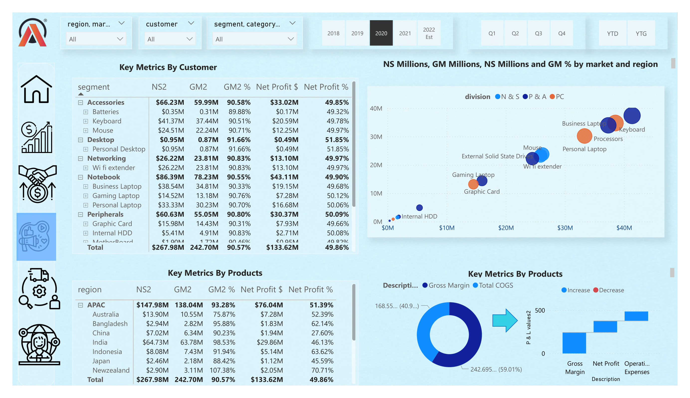
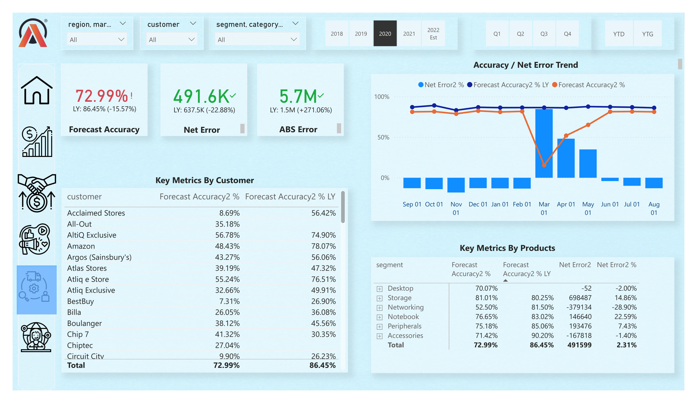

# Business Insights Dashboard

## Overview
The Business Insights Dashboard provides a comprehensive analysis of various business metrics. This tool helps organizations monitor key performance indicators (KPIs) across different departments such as finance, sales, marketing, and supply chain. The dashboard features an intuitive interface that allows users to track profit & loss, sales performance, customer insights, product metrics, and forecast accuracy in real-time.

## Features
- **Info Section**: Download user manuals and get quick access to key information.
- **Finance**: Access Profit and Loss (P&L) statements, track net sales, and view growth metrics.
- **Sales**: Analyze customer performance, net sales, gross margins, and profitability.
- **Marketing**: Evaluate product performance with metrics like net sales and gross margin.
- **Supply Chain**: Get insights into forecast accuracy, net error, and risk profiles across product segments and regions.
- **Executive**: Access detailed forecast accuracy reports and risk profiles for high-level business decisions.
- **Support**: Connect with support specialists to resolve any issues.

## Screenshots

### 1. **Business Insights 360 Dashboard Overview**

   - This screenshot shows the main dashboard for "Business Insights 360." It features sections such as Info, Finance, Sales, Marketing, Supply Chain, Executive, and Support. Each section offers business insights through various metrics and icons.

### 2. **P&L and Net Sales Performance**

   - The screenshot showcases detailed profit & loss (P&L) metrics for 2020, including net sales, gross margins, and operational expenses. It also highlights net sales performance over time with visual charts and performance metrics broken down by region and product.

### 3. **Key Metrics by Customer and Product**

   - This screenshot presents key metrics for individual customers and product segments. It includes a scatter plot visualizing sales performance by region and shows customer performance, net sales, and gross margins.

### 4. **Product and Customer Insights**

   - This image provides deeper insights into product performance by category, including net sales and profitability metrics for each product segment. Forecast accuracy and error trends are also visualized.

### 5. **Forecast Accuracy and Error Trends**

   - This screenshot highlights forecast accuracy trends over time, alongside net error trends for various products and customers. It includes a comparison of forecast accuracy and error metrics.

